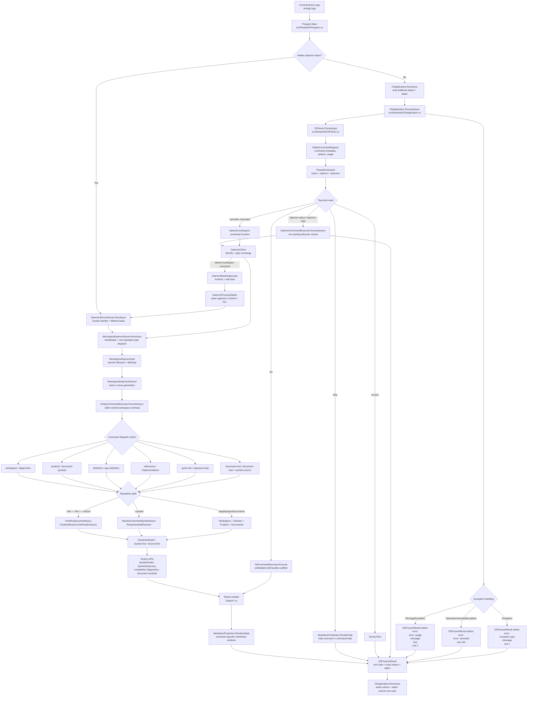

# RoslynKit Map

Resident architecture context for first-pass navigation. Atlas stores durable routing facts only; use `git ls-files`, `rg`, RoslynKit live commands, tests, and direct file reads for current facts.

## Shape

- Solution: `RoslynKit.slnx`
- Product: `src/RoslynKit/`
- Tests: `tests/RoslynKit.Tests/`
- Test utility: `tests/RoslynKit.WorkspaceGraphDump/`
- Fixture input: `tests/FixtureWorkspace/App/`
- Docs and packaging: [README.md](../../README.md), [docs/](../../docs/), [docs/daemon.md](../../docs/daemon.md), [docs/agents/](../../docs/agents/), `scripts/`
- Agent assets: [AGENTS.md](../../AGENTS.md), [.agents/skills/roslynkit/](../../.agents/skills/roslynkit/), [.agents/skills/roslynkit/references/commands.md](../../.agents/skills/roslynkit/references/commands.md), [.agents/skills/roslynkit/references/output.md](../../.agents/skills/roslynkit/references/output.md), [.agents/skills/roslynkit-dev/SKILL.md](../../.agents/skills/roslynkit-dev/SKILL.md), [.agents/skills/grill-me/SKILL.md](../../.agents/skills/grill-me/SKILL.md), `.agents/skills/commit-context/`, `.agents/skills/git-commit-push/`, [.codex/atlas/repo-map.md](repo-map.md)

## Runtime Flow

- `Program.Main` routes the exact hidden daemon token through `DaemonServerRunner` before public parsing; all ordinary arguments create `CliApplication` with separate stdout and stderr writers and call `RunAsync`.
- `CliApplication.ExecuteAsync` parses args and returns an exact buffered `CliProcessResult`; `RunAsync` writes that result to the configured process streams.
- Help, version, and init execute entirely locally. Daemon lifecycle controls parse locally and use a non-starting client exchange; workspace-backed commands cross the injected `DaemonClient` boundary.
- `WorkspaceCommandRouter` supplies the default function, calls `RoslynCommandExecutor.ExecuteAsync`, and renders through `MarkdownProjection` without writing directly to process streams.
- `CliParser` resolves the longest registered command-token path, then validates selector/option combinations against `BuiltinCommandRegistry`; this supports leaf commands such as `daemon status` while preserving canonical string command names.
- `DaemonCommandExecutor` handles `daemon status` and `daemon stop` through `DaemonClient` without loading a workspace or starting a daemon; absence reports `state: not-running`, running status renders the host snapshot, and an acknowledged stop reports `state: stopping`.
- `GitWorkspaceIdentityResolver` validates the committed Git worktree boundary and captures the target, `global.json`, SDK/MSBuild, build environment, RoslynKit build, protocol, and architecture compatibility inputs. Both `DaemonClient` and `DaemonServerRunner` consume the same resolution before deriving the endpoint.
- `DaemonIdentityResolver` adds the Windows SID or Unix effective UID and canonical local IPC runtime directory, while `DaemonEndpointName` canonicalizes the complete compatibility identity and emits a fixed opaque SHA-256 endpoint name. `DaemonServerRunner` uses the endpoint for the lifetime lease and listener.
- `DaemonProtocol` reads and writes bounded four-byte little-endian strict UTF-8 JSON frames over any stream, while typed handshake, command, status, and stop messages carry protocol versions and request IDs. `DaemonNamedPipe` supplies local asynchronous current-user-only byte-mode streams consumed by `WorkspaceDaemonServer`.
- `PathCanonicalizer` is the shared reparse-point-aware absolute path boundary used by Git workspace identity and daemon command path options.
- `GitWorktreeFingerprintService` performs the request-time stable `HEAD` / raw porcelain / per-file `hash-object --no-filters` capture, coalesces concurrent callers, and returns deterministic structural fingerprints or typed cache-reuse failures.
- `WorkspaceDaemonSession` owns disposable workspace generations, reconciles fingerprints before leasing an immutable snapshot, drains active readers before full reload, admits at most three clean readers, gives pending reloads priority, and performs the single quiet-period retry. The hidden server owns it through `WorkspaceDaemonHost`; public workspace commands reach it through `DaemonClient`.
- `WorkspaceDaemonHost` is the transport-independent lifecycle owner around one session. `WorkspaceDaemonServer` adds the bounded concurrent named-pipe accept loop, required handshake, single-operation dispatch, target revalidation, and prompt disconnect cancellation. `DaemonServerRunner` resolves the hidden process identity, holds the per-endpoint lifetime lease, and constructs the server.
- `DaemonPipeClient` owns connect, handshake, single-operation exchange, and response correlation. `DaemonClient` resolves endpoints, sends directly to running servers, or uses the distinct `DaemonBootstrapLease` to serialize recheck, `DaemonProcessStarter` self-launch, and handshake readiness. The Windows starter mirrors Roslyn's compiler-server `CreateProcess` boundary with no window, no inherited handles, and invalid standard handles; other platforms use non-waiting `Process.Start` with redirected streams. Public lifecycle commands reuse the exchange without startup. Exact standalone fallback remains unimplemented.
- `ProcessCommandRunner` is the argument-list-only, buffered child-process boundary used by workspace identity and fingerprint probes; its byte-output path preserves NUL-delimited Git status records without invoking a shell.
- `RoslynCommandExecutor.ExecuteAsync(command, cancellationToken)` owns standalone workspace loading and delegates to the caller-owned workspace overload; the overload resolves documents or symbols, invokes Roslyn APIs, and returns result models without disposing the workspace.
- `MarkdownProjection` is the deterministic markdown output renderer for successful commands.

## Domains

- CLI routing: [Program.cs](../../src/RoslynKit/Program.cs), [CliApplication.cs](../../src/RoslynKit/CliApplication.cs), [CliProcessResult.cs](../../src/RoslynKit/CliProcessResult.cs), [WorkspaceCommandRouter.cs](../../src/RoslynKit/WorkspaceCommandRouter.cs), [DaemonCommandExecutor.cs](../../src/RoslynKit/DaemonCommandExecutor.cs), [CliParser.cs](../../src/RoslynKit/CliParser.cs), [BuiltinCommandRegistry.cs](../../src/RoslynKit/BuiltinCommandRegistry.cs), [RoslynCommandExecutor.cs](../../src/RoslynKit/RoslynCommandExecutor.cs), [InitCommandExecutor.cs](../../src/RoslynKit/InitCommandExecutor.cs); start symbols `Program.Main`, `CliApplication.RunAsync`, `CliApplication.ExecuteAsync`, `WorkspaceCommandRouter.ExecuteAsync`, `DaemonCommandExecutor.ExecuteAsync`, `CliParser.Parse`, `RoslynCommandExecutor.ExecuteAsync`, `InitCommandExecutor.Execute`; tests [CliParserTests.cs](../../tests/RoslynKit.Tests/CliParserTests.cs), [CliOutputTests.cs](../../tests/RoslynKit.Tests/CliOutputTests.cs), [InitCommandExecutorTests.cs](../../tests/RoslynKit.Tests/InitCommandExecutorTests.cs), [CommandExecution/](../../tests/RoslynKit.Tests/CommandExecution/), [MarkdownFormatTests.cs](../../tests/RoslynKit.Tests/MarkdownFormatTests.cs).
- Workspace/navigation: `RoslynCommandExecutor.cs`, `RoslynWorkspaceLoader.cs`, `PositionResolver.cs`, `RoslynSymbolResolver.cs`, `RoslynDocumentFilters.cs`, `RoslynSymbolSearch.cs`, `RoslynSignatureHelpService.cs`; start symbols `RoslynWorkspaceLoader.LoadAsync`, `PositionResolver.GetPositionAsync`, `RoslynSymbolResolver.ResolveAsync`, `RoslynSymbolSearch.EnumerateSourceSymbols`; tests `CommandExecution/`, `SymbolsCommandTests.cs`, `CliOutputTests.cs`.
- Daemon identity foundation: [GitWorkspaceIdentityResolver.cs](../../src/RoslynKit/GitWorkspaceIdentityResolver.cs), [GitWorkspaceIdentity.cs](../../src/RoslynKit/GitWorkspaceIdentity.cs), [PathCanonicalizer.cs](../../src/RoslynKit/PathCanonicalizer.cs), [RoslynKitBuildInfo.cs](../../src/RoslynKit/RoslynKitBuildInfo.cs), [ProcessCommandRunner.cs](../../src/RoslynKit/ProcessCommandRunner.cs); start symbols `GitWorkspaceIdentityResolver.ResolveAsync`, `PathCanonicalizer.ResolveExistingPath`; tests [GitWorkspaceIdentityResolverTests.cs](../../tests/RoslynKit.Tests/GitWorkspaceIdentityResolverTests.cs). Public client and hidden server routing both consume this seam.
- Daemon endpoint identity: [DaemonIdentity.cs](../../src/RoslynKit/DaemonIdentity.cs), [DaemonEndpointName.cs](../../src/RoslynKit/DaemonEndpointName.cs), [GitWorkspaceIdentity.cs](../../src/RoslynKit/GitWorkspaceIdentity.cs); start symbols `DaemonIdentityResolver.Resolve`, `DaemonEndpointName.Create`; tests [DaemonEndpointNameTests.cs](../../tests/RoslynKit.Tests/DaemonEndpointNameTests.cs) and [GitWorkspaceIdentityResolverTests.cs](../../tests/RoslynKit.Tests/GitWorkspaceIdentityResolverTests.cs). Mutable Git `HEAD` and worktree fingerprints remain outside endpoint selection.
- Daemon framed transport: [DaemonProtocol.cs](../../src/RoslynKit/DaemonProtocol.cs), [DaemonProtocolMessages.cs](../../src/RoslynKit/DaemonProtocolMessages.cs), [DaemonNamedPipe.cs](../../src/RoslynKit/DaemonNamedPipe.cs), [PathCanonicalizer.cs](../../src/RoslynKit/PathCanonicalizer.cs); start symbols `DaemonProtocol.ReadRequestAsync`, `DaemonProtocol.WriteResponseAsync`, `DaemonCommandRequest.Create`, `DaemonNamedPipe.CreateServer`; tests [DaemonProtocolFramingTests.cs](../../tests/RoslynKit.Tests/DaemonProtocolFramingTests.cs), [DaemonProtocolMessageTests.cs](../../tests/RoslynKit.Tests/DaemonProtocolMessageTests.cs), and [NamedPipeDaemonTransportTests.cs](../../tests/RoslynKit.Tests/NamedPipeDaemonTransportTests.cs). This seam owns framing, read-only command validation, and local pipe construction, not daemon hosting, dispatch, process lifecycle, or CLI fallback.
- Git worktree fingerprinting: [GitWorktreeFingerprintService.cs](../../src/RoslynKit/GitWorktreeFingerprintService.cs), [GitWorktreeFingerprint.cs](../../src/RoslynKit/GitWorktreeFingerprint.cs), [GitPorcelainParser.cs](../../src/RoslynKit/GitPorcelainParser.cs), [ProcessCommandRunner.cs](../../src/RoslynKit/ProcessCommandRunner.cs); start symbol `GitWorktreeFingerprintService.CaptureAsync`; tests [GitWorktreeFingerprintServiceTests.cs](../../tests/RoslynKit.Tests/GitWorktreeFingerprintServiceTests.cs). This seam is request-time mutable state and remains separate from daemon compatibility identity.
- Workspace daemon session: [WorkspaceDaemonSession.cs](../../src/RoslynKit/WorkspaceDaemonSession.cs), [GitWorktreeFingerprintService.cs](../../src/RoslynKit/GitWorktreeFingerprintService.cs), [RoslynWorkspaceLoader.cs](../../src/RoslynKit/RoslynWorkspaceLoader.cs), [RoslynCommandExecutor.cs](../../src/RoslynKit/RoslynCommandExecutor.cs); start symbols `WorkspaceDaemonSession.ExecuteAsync`, `WorkspaceDaemonGeneration.LoadAsync`; tests [WorkspaceDaemonSessionTests.cs](../../tests/RoslynKit.Tests/WorkspaceDaemonSessionTests.cs). This seam owns generation lifetime, fingerprint baselines, reload coordination, and bounded clean-reader admission, not daemon hosting, process lifecycle, IPC dispatch, or CLI fallback.
- Workspace daemon lifecycle: [WorkspaceDaemonHost.cs](../../src/RoslynKit/WorkspaceDaemonHost.cs), [WorkspaceDaemonServer.cs](../../src/RoslynKit/WorkspaceDaemonServer.cs), [DaemonServerRunner.cs](../../src/RoslynKit/DaemonServerRunner.cs), [DaemonLifetimeLease.cs](../../src/RoslynKit/DaemonLifetimeLease.cs), [WorkspaceDaemonSession.cs](../../src/RoslynKit/WorkspaceDaemonSession.cs), [DaemonProtocolMessages.cs](../../src/RoslynKit/DaemonProtocolMessages.cs); start symbols `WorkspaceDaemonHost.ExecuteAsync`, `WorkspaceDaemonServer.RunAsync`, `DaemonServerRunner.RunAsync`; tests [WorkspaceDaemonHostTests.cs](../../tests/RoslynKit.Tests/WorkspaceDaemonHostTests.cs), [WorkspaceDaemonServerTests.cs](../../tests/RoslynKit.Tests/WorkspaceDaemonServerTests.cs), [DaemonLifetimeLeaseTests.cs](../../tests/RoslynKit.Tests/DaemonLifetimeLeaseTests.cs), and [ProgramTests.cs](../../tests/RoslynKit.Tests/ProgramTests.cs). This seam owns request registration, deadline and disconnect cancellation, idle timing, status snapshots, graceful stop, hidden-process construction, one-live-server enforcement, and named-pipe dispatch.
- Daemon client and bootstrap: [DaemonClient.cs](../../src/RoslynKit/DaemonClient.cs), [DaemonPipeClient.cs](../../src/RoslynKit/DaemonPipeClient.cs), [DaemonBootstrapLease.cs](../../src/RoslynKit/DaemonBootstrapLease.cs), [DaemonProcessStarter.cs](../../src/RoslynKit/DaemonProcessStarter.cs), [DaemonCommandExecutor.cs](../../src/RoslynKit/DaemonCommandExecutor.cs); start symbols `DaemonClient.ExecuteAsync`, `DaemonPipeClient.SendAsync`, `DaemonBootstrapLease.TryAcquire`, `DaemonProcessStarter.Start`, `DaemonCommandExecutor.ExecuteAsync`; tests [DaemonClientTests.cs](../../tests/RoslynKit.Tests/DaemonClientTests.cs), [DaemonPipeClientTests.cs](../../tests/RoslynKit.Tests/DaemonPipeClientTests.cs), [DaemonBootstrapLeaseTests.cs](../../tests/RoslynKit.Tests/DaemonBootstrapLeaseTests.cs), and [DaemonProcessStarterTests.cs](../../tests/RoslynKit.Tests/DaemonProcessStarterTests.cs). This seam owns public connection, handshake validation, startup serialization, same-build self-launch, readiness polling, and non-starting lifecycle controls; exact standalone fallback remains outside it.
- Markdown output contract: `MarkdownProjection.cs`, result model types under `Output/`, [.agents/skills/roslynkit/references/output.md](../../.agents/skills/roslynkit/references/output.md); tests `MarkdownFormatTests.cs`, `CliOutputTests.cs`.
- Tooling/packaging: `RoslynKit.csproj`, `InitCommandExecutor.cs`, `scripts/prepare-roslynkit-package.ps1`, `scripts/install-roslynkit-dev.ps1`, `scripts/RoslynKit.Packaging.ps1`, [docs/dev-install.md](../../docs/dev-install.md), [docs/dotnet-tool-release.md](../../docs/dotnet-tool-release.md), [docs/agents/skill-maintenance.md](../../docs/agents/skill-maintenance.md); tests usually start with `CliOutputTests.cs`, `InitCommandExecutorTests.cs`, plus build/pack smoke commands.
- Agent/navigation policy: [AGENTS.md](../../AGENTS.md), [docs/agents/README.md](../../docs/agents/README.md), [.agents/skills/roslynkit/SKILL.md](../../.agents/skills/roslynkit/SKILL.md), [.agents/skills/roslynkit/references/commands.md](../../.agents/skills/roslynkit/references/commands.md), [.agents/skills/roslynkit/references/output.md](../../.agents/skills/roslynkit/references/output.md), [.agents/skills/roslynkit-dev/SKILL.md](../../.agents/skills/roslynkit-dev/SKILL.md), [.agents/skills/grill-me/SKILL.md](../../.agents/skills/grill-me/SKILL.md), this map.

## Test Routing

- Parser and option validation -> `tests/RoslynKit.Tests/CliParserTests.cs`
- Init scaffolding and guardrails -> `tests/RoslynKit.Tests/InitCommandExecutorTests.cs`
- Command execution and Roslyn navigation flows -> `tests/RoslynKit.Tests/CommandExecution/`
- Help/version/error output -> `tests/RoslynKit.Tests/CliOutputTests.cs`
- Markdown rendering contract -> `tests/RoslynKit.Tests/MarkdownFormatTests.cs`
- Symbol search and document-symbol behavior -> `tests/RoslynKit.Tests/SymbolsCommandTests.cs`
- Repo and fixture path helpers -> `tests/RoslynKit.Tests/TestPaths.cs`

## Commands

- Build: `dotnet build .\RoslynKit.slnx --tl:off --nologo "-clp:ErrorsOnly;NoSummary"`
- Test: `dotnet test .\RoslynKit.slnx`
- Run: `dotnet run --project .\src\RoslynKit -- help`
- Pack: `dotnet pack .\src\RoslynKit\RoslynKit.csproj`
- Workspace graph: `dotnet run --project .\tests\RoslynKit.WorkspaceGraphDump -- .\RoslynKit.slnx`

## Navigation Rules

- Use `roslynkit-dev` for repo-local C# semantic inspection unless the task is explicitly about the stable global tool.
- Prefer tests before implementation when available.
- For command or feature tracing, follow the runtime spine first, then use RoslynKit or direct line reads for the narrow unclear hop; use broad literal search only after the spine fails.
- Prefer RoslynKit `symbols`, `document-symbols`, `definition`, `references`, `implementations`, `type-definition`, `quick-info`, `signature-help`, `document-lines`, and `symbol-source` over broad source reads.
- Use sparse XML comments surfaced by documentation-enabled RoslynKit output as next-hop hints, not as exhaustive documentation.
- Do not use Atlas as a file inventory, test inventory, symbol graph, reference graph, or source cache.
- Ignore first: `artifacts/`, `TestResults/`, `.vs/`, `Visual Studio 18/`, `bin/`, `obj/`, `*.nupkg`.

Last verified: `2026-07-31`
