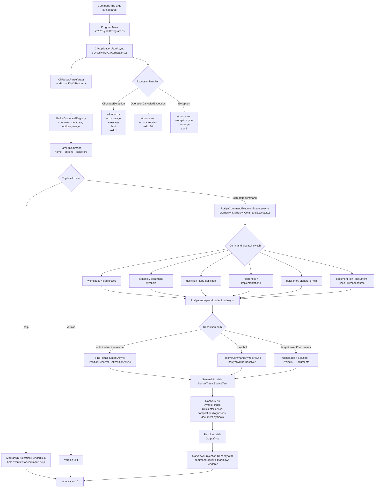

# RoslynKit Map

Resident architecture context for first-pass navigation. Atlas stores durable routing facts only; use `git ls-files`, `rg`, RoslynKit live commands, tests, and direct file reads for current facts.

## Shape

- Solution: `RoslynKit.slnx`
- Product: `src/RoslynKit/`
- Tests: `tests/RoslynKit.Tests/`
- Test utility: `tests/RoslynKit.WorkspaceGraphDump/`
- Fixture input: `tests/FixtureWorkspace/App/`
- Docs and packaging: `README.md`, `docs/`, `scripts/`
- Agent assets: `AGENTS.md`, `.agents/skills/roslynkit*/`, `.agents/skills/commit-context/`, `.agents/skills/git-commit-push/`, `.codex/agents/`, `.codex/atlas/repo-map.md`

## Runtime Flow

- `Program.Main` creates `CliApplication` and calls `RunAsync`.
- `CliApplication.RunAsync` parses args, handles help/version, calls `RoslynCommandExecutor.ExecuteAsync`, and renders through `MarkdownProjection`.
- `CliParser` validates command tokens and selector/option combinations against `BuiltinCommandRegistry`.
- `RoslynCommandExecutor` loads workspaces, resolves documents or symbols, invokes Roslyn APIs, and returns result models.
- `MarkdownProjection` is the deterministic markdown output renderer for successful commands.

## Domains

- CLI routing: `Program.cs`, `CliApplication.cs`, `CliParser.cs`, `BuiltinCommandRegistry.cs`, `RoslynCommandExecutor.cs`; start symbols `Program.Main`, `CliApplication.RunAsync`, `CliParser.Parse`, `RoslynCommandExecutor.ExecuteAsync`; tests `CliParserTests.cs`, `CliOutputTests.cs`, `CommandExecution/`, `MarkdownFormatTests.cs`.
- Workspace/navigation: `RoslynCommandExecutor.cs`, `RoslynWorkspaceLoader.cs`, `PositionResolver.cs`, `RoslynSymbolResolver.cs`, `RoslynDocumentFilters.cs`, `RoslynSymbolSearch.cs`, `RoslynSignatureHelpService.cs`; start symbols `RoslynWorkspaceLoader.LoadAsync`, `PositionResolver.GetPositionAsync`, `RoslynSymbolResolver.ResolveAsync`, `RoslynSymbolSearch.EnumerateSourceSymbols`; tests `CommandExecution/`, `SymbolsCommandTests.cs`, `CliOutputTests.cs`.
- Markdown output: `MarkdownProjection.cs`, result model types under `Output/`, `docs/markdown-output-format.md`; tests `MarkdownFormatTests.cs`, `CliOutputTests.cs`.
- Tooling/packaging: `RoslynKit.csproj`, `scripts/prepare-roslynkit-package.ps1`, `scripts/install-roslynkit-dev.ps1`, `scripts/RoslynKit.Packaging.ps1`, `docs/dev-install.md`, `docs/dotnet-tool-release.md`, `docs/skill-maintenance.md`; tests usually start with `CliOutputTests.cs` plus build/pack smoke commands.
- Agent/navigation policy: `AGENTS.md`, `.agents/skills/roslynkit*/SKILL.md`, `.codex/agents/*.toml`, this map.

## Test Routing

- Parser and option validation -> `tests/RoslynKit.Tests/CliParserTests.cs`
- Command execution and Roslyn navigation flows -> `tests/RoslynKit.Tests/CommandExecution/`
- Help/version/error output -> `tests/RoslynKit.Tests/CliOutputTests.cs`
- Markdown rendering contract -> `tests/RoslynKit.Tests/MarkdownFormatTests.cs`
- Symbol search and document-symbol behavior -> `tests/RoslynKit.Tests/SymbolsCommandTests.cs`
- Repo and fixture path helpers -> `tests/RoslynKit.Tests/TestPaths.cs`

## Commands

- Build: `dotnet build .\RoslynKit.slnx --tl:off --nologo "-clp:ErrorsOnly;NoSummary"`
- Test: `dotnet test .\RoslynKit.slnx`
- Run: `dotnet run --project .\src\RoslynKit -- help`
- Pack: `dotnet pack .\src\RoslynKit\RoslynKit.csproj`
- Workspace graph: `dotnet run --project .\tests\RoslynKit.WorkspaceGraphDump -- .\RoslynKit.slnx`

## Navigation Rules

- Use `roslynkit-dev` for repo-local C# semantic inspection unless the task is explicitly about the stable global tool.
- Prefer tests before implementation when available.
- For command or feature tracing, follow the runtime spine first, then use RoslynKit or direct line reads for the narrow unclear hop; use broad literal search only after the spine fails.
- Prefer RoslynKit `symbols`, `document-symbols`, `definition`, `references`, `implementations`, `type-definition`, `quick-info`, `signature-help`, `document-lines`, and `symbol-source` over broad source reads.
- Use sparse XML comments surfaced by documentation-enabled RoslynKit output as next-hop hints, not as exhaustive documentation.
- Do not use Atlas as a file inventory, test inventory, symbol graph, reference graph, or source cache.
- Ignore first: `artifacts/`, `TestResults/`, `.vs/`, `Visual Studio 18/`, `bin/`, `obj/`, `*.nupkg`.

Last verified: `2026-07-06`
