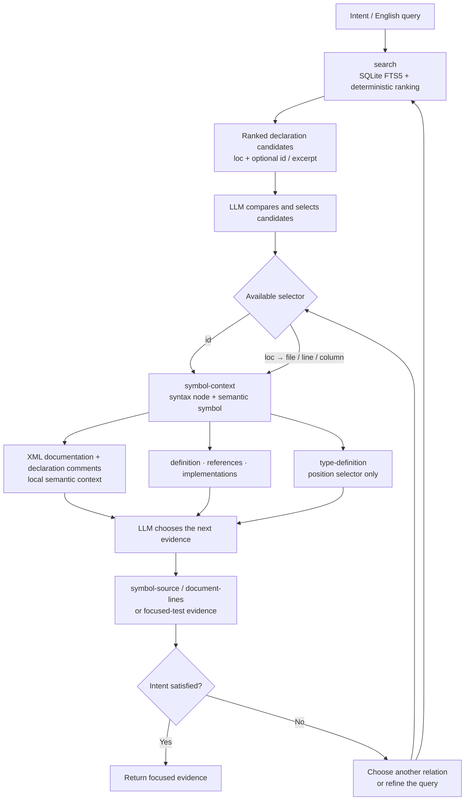

# RoslynKit

[](https://github.com/jgador/roslynkit)

RoslynKit is an independent Roslyn-powered command-line tool plus the [.agents/skills/roslynkit/SKILL.md](.agents/skills/roslynkit/SKILL.md) workflow that helps coding agents navigate C# solutions through Roslyn instead of relying only on grep-style text search.

Install the CLI, point it at a `.slnx`, `.sln`, or `.csproj` file, and it can answer source questions that normally require an IDE:

- What projects and source files does this solution load?
- Where is this class or method defined?
- What references this symbol?
- What implementations exist for this interface or method?
- What type, signature, or XML documentation is available at this call site?
- What compiler diagnostics does Roslyn report for the loaded code?

The CLI loads .NET projects with MSBuild and asks Roslyn for source information. Roslyn is the official .NET compiler platform for C# and Visual Basic; RoslynKit currently focuses on C# inspection.

RoslynKit prints stable terminal output so people can read it, copy it into issues, or use it in scripts.


## Install

Install the global .NET tool from NuGet.org:

```powershell
dotnet tool install --global roslynkit
roslynkit version
```

Update an existing install:

```powershell
dotnet tool update --global roslynkit
```

Set up RoslynKit for coding-agent use from a Git repository root:

```powershell
cd C:\repo\MyApp
roslynkit init
```

`roslynkit init` scaffolds the RoslynKit skill bundle for Codex by default. Use `--agent claude`, `--agent copilot`, or `--agent all` when another supported agent should receive the same bundle. The command checks for a `.git` directory or file in the current directory so setup happens at the repository root.

For local package feeds and side-by-side prerelease development installs, see [docs/dev-install.md](docs/dev-install.md). For maintainer packaging and release steps, see [docs/dotnet-tool-release.md](docs/dotnet-tool-release.md).

## Common Tasks

| Command | Use it to |
| --- | --- |
| `init` | Scaffold the RoslynKit skill bundle into a Git repository for Codex, Claude, GitHub Copilot, or all supported agents. |
| `workspace` | See which projects and documents load. |
| `diagnostics` | Check compiler diagnostics. |
| `index` | Prepare or refresh a persistent C# search index for one target. |
| `search` | Find C# declarations from an English-oriented code question. |
| `symbol-context` | Inspect a selected syntax node, resolved symbol, nearby syntax graph, and declaration metadata. |
| `symbols` | Find C# declarations by name. |
| `document-symbols` | List declarations inside one file. |
| `definition` | Jump from a symbol or cursor position to its definition. |
| `type-definition` | Jump from a cursor position to the definition of its type. |
| `references` | Find uses of a class, method, property, field, or other symbol. |
| `implementations` | Find implementations of an interface, abstract member, or overridable member. |
| `quick-info` | Show type, signature, and documentation at a cursor position. |
| `signature-help` | Show overload information for a method call. |
| `document-lines`, `document-text`, `symbol-source` | Read source from the loaded workspace. |

For exact command syntax, use `roslynkit help`, `roslynkit help <command>`, or [.agents/skills/roslynkit/references/commands.md](.agents/skills/roslynkit/references/commands.md).

## Quick Start

Start with repository setup, then confirm RoslynKit can load a solution or project:

```powershell
cd C:\repo\MyApp
roslynkit init
roslynkit workspace
roslynkit diagnostics
```

Run `roslynkit init` from the repository root. The command checks the current directory for `.git` and fails from a parent folder or nested source folder that does not contain `.git`.

Find a declaration by name, then reuse the returned symbol ID for more precise navigation:

```powershell
roslynkit symbols --query MyService --exact --kind class
roslynkit definition --symbol "T:MyApp.MyService"
roslynkit references --symbol "M:MyApp.MyService.Execute(System.String)" --max-results 25
roslynkit symbol-source --symbol "M:MyApp.MyService.Execute(System.String)"
```

Read a small source window from the workspace Roslyn loaded:

```powershell
roslynkit document-lines --file ./src/MyApp/Service.cs --start-line 40 --end-line 52
```

By default, RoslynKit finds the nearest standard `.git/` directory and loads every tracked or unignored `.csproj` file in that repository, including disconnected project components. Use optional `--target` only to narrow a command to a `.slnx`, `.sln`, `.slnf`, `.csproj`, or repository-directory scope. Source positions are one-based, matching editor line and column numbers. Implicit repository and catalog discovery does not yet support linked worktrees, submodule `.git` indirection files, bare repositories, or non-Git repositories.

## Search Index

Use `search` when the relevant declaration is not known by name but an English-oriented description is available. It builds on SQLite Full-Text Search 5 (FTS5), then uses Best Matching 25 (BM25) ranking internally to order C# symbols. The rank is a discovery heuristic, not a claim that the first result is the correct navigation target.

The repository and database are implicit in ordinary use:

```powershell
roslynkit index
roslynkit search --query "where is configuration validated during startup"
```

RoslynKit stores the repository catalog at `.roslynkit/roslynkit.db` and creates `.roslynkit/.gitignore` for the database, its write-ahead logging (WAL) sidecars, and that generated ignore file. It never writes inside `.git/` or modifies the repository's root `.gitignore`. `--index-path` remains an advanced override and must resolve to an ignored path inside the repository.

One database belongs to one repository and stores separate partitions for repository and explicit-target scopes. In addition to Full-Text Search 5 (FTS5) fields, it persists project references, exact symbol metadata, declaration spans, structured comments, and containment, inheritance, interface implementation, and override relationships. Paths remain repository-relative in SQLite and are reconstructed from the current repository root for output.

`search` checks the repository fingerprint, refreshes stale records when needed, and queries SQLite first. `index` is the strict preparation command; use `--rebuild` to recreate the selected partition. With a fresh catalog, exact `symbols`, symbol-based `definition`, `symbol-source`, and `implementations` can complete without loading an MSBuild workspace. `references` remains a compiler operation on its first exact request and persists that bounded result for subsequent identical requests. Position-based context, quick info, signature help, diagnostics, and generated documents remain live Roslyn operations.

For a search-only workflow on a host that cannot load an MSBuild workspace, add `--text-only` to both `index` and `search`. This mode scans repository C# files into a separate in-process partition without MSBuild. Add `--compact` when a large language model (LLM) should judge ranked evidence without navigation metadata, and `--balanced` to reserve half of a bounded result set for focused tests when both production and test declarations match. `--text-only` cannot be combined with `--project`; use normal search when exact project evaluation or a follow-up `id:` is required.

```powershell
roslynkit index --text-only
roslynkit search --query "configuration validation fallback" --max-results 25 --text-only --compact --balanced
```

The search index accepts only projects with one target framework. It rejects multi-targeted projects instead of selecting a framework implicitly. Every indexed project and non-generated source document must have an existing physical path inside the target's Git worktree; missing project or non-generated source paths, external projects, and external linked non-generated source files are rejected. Generated source documents are skipped, including source-generated documents, generated paths below `bin` or `obj`, and sources with standard generated-code markers injected from extracted NuGet packages outside the worktree. By default a target search covers every project; use `--project` to narrow it, `--kind` to select symbol kinds, and `--max-results` to change the default limit of 25.

Search results are not command pipelines. They contain ranked symbols, locations, and, when available, `id:` values. An agent evaluates several results and follows a promising `id:` with `symbol-context`, `definition`, `references`, or `symbol-source`; a `loc:` value can guide a position-based command or narrow source read. RoslynKit does not accept search hits through standard input. When an `excerpt:` is present, `excerpt-source:` identifies whether its text came from documentation, an ordinary comment, a signature, or a body.

## Symbol Context

A syntax node is source structure, such as an `InvocationExpression` or `MethodDeclaration`. A symbol is the compiler-resolved identity connected to that structure, such as `M:MyApp.Validator.Validate(MyApp.Configuration)`. `symbol-context` starts from either identity or a source position and returns both views without persisting a syntax-tree node between commands.

```powershell
roslynkit search --query "where does startup validate configuration" --max-results 25
roslynkit symbol-context --symbol "M:MyApp.Validator.Validate(MyApp.Configuration)"
roslynkit symbol-context --file ./src/MyApp/Startup.cs --line 42 --column 18
roslynkit references --symbol "M:MyApp.Validator.Validate(MyApp.Configuration)" --max-results 25
```

`symbol-context` accepts exactly one selector: `--symbol <selector>`, or `--file` plus `--line` and `--column`. Position selection also supports the normal document-context options. Its output contains the selected node and resolved symbol, alternate declarations when applicable, nearest-first syntax ancestors, and bounded descendant nodes for declarations, invocations, constructions, and member references. The selected node and ancestors include source location, syntax kind, and available `name:` or `id:` values. Descendant items include source location, syntax kind, relationship, depth, and available `target-id:` values for the next semantic hop.

The command reports XML documentation separately from ordinary C# comments. Ordinary comments are structured with placement, style, location, and normalized text. `--max-results` defaults to `25` descendant items and `--max-comments` defaults to `3` comments; each bounded collection reports its count and truncation state.

The intended intent-to-evidence loop is:



This diagram describes the semantic workflow rather than the execution transport. RoslynKit provides deterministic results and stable identities. The LLM retains the intent, selects the next relationship, records visited identities or locations to avoid cycles, and stops after evidence satisfies that intent. Documentation and ordinary comments are routing hints, not proof; confirm a route with `definition`, `references`, `implementations`, `symbol-source`, or a narrow `document-lines` read.

## CLI Plus Skill Files

RoslynKit remains a normal short-lived command-line experience. It is not an MCP server, a Language Server Protocol (LSP) client, an editor service, or a background daemon. Performance state lives in the repository-local SQLite catalog rather than a persistent process, named pipe, or socket.

For AI coding tools, pair the CLI with a skill file that teaches the tool which commands to run. The stable skill lives at [.agents/skills/roslynkit/SKILL.md](.agents/skills/roslynkit/SKILL.md), and the repo-local development skill lives at [.agents/skills/roslynkit-dev/SKILL.md](.agents/skills/roslynkit-dev/SKILL.md). The integration model is still just command-line execution: install `roslynkit`, scaffold the skill bundle with `init`, then run `roslynkit <command> ...`.

Scaffold the stable skill bundle from the Git repository root:

```powershell
cd C:\repo\MyApp
roslynkit init
roslynkit init --agent claude
roslynkit init --agent copilot
roslynkit init --agent all
```

`roslynkit init` requires a `.git` directory or file in the current directory and refuses to replace changed files unless `--overwrite` is supplied. Running the command from a parent folder or nested source folder fails unless that folder is itself the Git root. The selected agent controls only the outer folder:

- `codex` -> `.agents/skills/roslynkit/`
- `claude` -> `.claude/skills/roslynkit/`
- `copilot` -> `.github/skills/roslynkit/`

The bundle contents stay the same for every agent: `SKILL.md` plus the `references/` docs.

## Selecting Documents

Document commands accept `--file <path>` and infer the repository from that file when `--target` is omitted.

Relative `--file` values resolve from the current working directory. Absolute paths are accepted unchanged.

Use `workspace` first when the same file appears in multiple project contexts, when a project targets multiple frameworks, or when you need generated, additional, or analyzer-config documents. If one path maps to multiple documents, retry with `--project <path>`, `--tfm <framework>`, or `--document-kind <source|sourceGenerated|additional|analyzerConfig>` from the usage error.

Use `document-lines` when you only need a small source range. Use `document-text` when you need the full resolved document, including source-generated, additional, or analyzer-config documents.

## Selecting Symbols

`definition`, `references`, `implementations`, and `symbol-context` accept either a cursor-style selector or a symbol selector:

```powershell
roslynkit definition --file ./src/MyApp/Service.cs --line 42 --column 18
roslynkit definition --symbol "M:MyApp.MyService.Execute(System.String)"
roslynkit symbol-context --symbol "M:MyApp.MyService.Execute(System.String)"
```

The `--symbol` selector can be a Roslyn documentation-comment ID emitted as `id:` in command output, such as `T:MyApp.MyService` or `M:MyApp.MyService.Execute(System.String)`, or a qualified symbol name such as `MyApp.MyService.Execute`. Prefix meanings are defined in [.agents/skills/roslynkit/references/output.md](.agents/skills/roslynkit/references/output.md).

If a qualified name is ambiguous, RoslynKit fails with candidate documentation-comment IDs so you can rerun the command with the exact symbol. Symbol IDs are more stable than saved line and column coordinates when files are changing.

## Output

Successful commands print compact markdown-flavored text:

```markdown
command: symbols
query: `MyService`
returned: 2/2
truncated: false

- kind: NamedType name: `MyApp.MyService` loc: `src/MyApp/MyService.cs:8:14-8:23` id: `T:MyApp.MyService`
  documentation: Runs application work for the current request.
```

Failures print a short error block and exit non-zero:

```text
error: usage
message: Missing required option '--query'.
```

Exit codes are `0` for success, `2` for usage errors, `130` for cancellation, and `1` for other failures. See [.agents/skills/roslynkit/references/output.md](.agents/skills/roslynkit/references/output.md) for the complete output contract.

## Documentation

- [.agents/skills/roslynkit/references/commands.md](.agents/skills/roslynkit/references/commands.md): generated command names, usage strings, and options.
- [.agents/skills/roslynkit/references/output.md](.agents/skills/roslynkit/references/output.md): command output contract.
- [docs/dev-install.md](docs/dev-install.md): side-by-side prerelease development install.
- [docs/dotnet-tool-release.md](docs/dotnet-tool-release.md): maintainer packaging and release workflow.
- [docs/roslyn-lsp-commands.md](docs/roslyn-lsp-commands.md): Roslyn language-server inventory and RoslynKit planning coverage.
- [docs/benchmark.md](docs/benchmark.md): opt-in Bash-controlled raw-text versus RoslynKit text-only token benchmark.
- [docs/agents/README.md](docs/agents/README.md): operational docs for people maintaining RoslynKit skill files and AI-tool guidance.

## Non-Goals

- No MCP transport.
- No LSP transport.
- No background server or persistent inter-process communication transport.
- No editor-specific protocol coupling.
- No source mutation by default. If edit-producing features are added later, they should return deterministic proposed edits before any apply mode exists.
