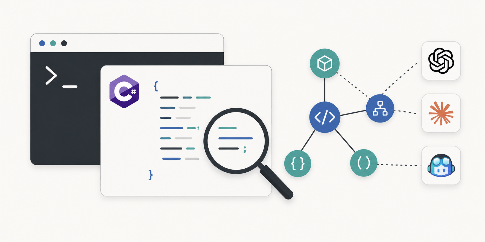

# RoslynKit

[](https://github.com/jgador/roslynkit)

RoslynKit is an independent Roslyn-powered command-line tool plus the [.agents/skills/roslynkit/SKILL.md](.agents/skills/roslynkit/SKILL.md) workflow that helps coding agents navigate C# solutions through Roslyn instead of relying only on grep-style text search.

Install the CLI, point it at a `.slnx`, `.sln`, or `.csproj` file, and it can answer source questions that normally require an IDE:

- What projects and source files does this solution load?
- Where is this class or method defined?
- What references this symbol?
- What implementations exist for this interface or method?
- What type, signature, or XML documentation is available at this call site?
- What compiler diagnostics does Roslyn report for the loaded code?

The CLI loads .NET projects with MSBuild and asks Roslyn for source information. Roslyn is the official .NET compiler platform for C# and Visual Basic; RoslynKit currently focuses on C# inspection.

RoslynKit prints stable terminal output so people can read it, copy it into issues, or use it in scripts.



## Install

Install the global .NET tool from NuGet.org:

```powershell
dotnet tool install --global roslynkit
roslynkit version
```

Update an existing install:

```powershell
dotnet tool update --global roslynkit
```

Set up RoslynKit for coding-agent use from a Git repository root:

```powershell
cd C:\repo\MyApp
roslynkit init
```

`roslynkit init` scaffolds the RoslynKit skill bundle for Codex by default. Use `--agent claude`, `--agent copilot`, or `--agent all` when another supported agent should receive the same bundle. The command checks for a `.git` directory or file in the current directory so setup happens at the repository root.

For local package feeds and side-by-side prerelease development installs, see [docs/dev-install.md](docs/dev-install.md). For maintainer packaging and release steps, see [docs/dotnet-tool-release.md](docs/dotnet-tool-release.md).

## Common Tasks

| Command | Use it to |
| --- | --- |
| `init` | Scaffold the RoslynKit skill bundle into a Git repository for Codex, Claude, GitHub Copilot, or all supported agents. |
| `workspace` | See which projects and documents load. |
| `diagnostics` | Check compiler diagnostics. |
| `index` | Prepare or refresh a persistent C# search index for one target. |
| `search` | Find C# declarations from an English-oriented code question. |
| `symbols` | Find C# declarations by name. |
| `document-symbols` | List declarations inside one file. |
| `definition` | Jump from a symbol or cursor position to its definition. |
| `type-definition` | Jump from a cursor position to the definition of its type. |
| `references` | Find uses of a class, method, property, field, or other symbol. |
| `implementations` | Find implementations of an interface, abstract member, or overridable member. |
| `quick-info` | Show type, signature, and documentation at a cursor position. |
| `signature-help` | Show overload information for a method call. |
| `document-lines`, `document-text`, `symbol-source` | Read source from the loaded workspace. |

For exact command syntax, use `roslynkit help`, `roslynkit help <command>`, or [.agents/skills/roslynkit/references/commands.md](.agents/skills/roslynkit/references/commands.md).

## Quick Start

Start with repository setup, then confirm RoslynKit can load a solution or project:

```powershell
cd C:\repo\MyApp
roslynkit init
roslynkit workspace --target .\MySolution.slnx
roslynkit diagnostics --target .\MySolution.slnx
```

Run `roslynkit init` from the repository root. The command checks the current directory for `.git` and fails from a parent folder or nested source folder that does not contain `.git`.

Find a declaration by name, then reuse the returned symbol ID for more precise navigation:

```powershell
roslynkit symbols --target .\MySolution.slnx --query MyService --exact --kind class
roslynkit definition --target .\MySolution.slnx --symbol "T:MyApp.MyService"
roslynkit references --target .\MySolution.slnx --symbol "M:MyApp.MyService.Execute(System.String)" --max-results 20
roslynkit symbol-source --target .\MySolution.slnx --symbol "M:MyApp.MyService.Execute(System.String)"
```

Read a small source window from the workspace Roslyn loaded:

```powershell
roslynkit document-lines --target .\MySolution.slnx --file .\src\MyApp\Service.cs --start-line 40 --end-line 52
```

Targets can be `.slnx`, `.sln`, or `.csproj` files. Source positions are one-based, matching editor line and column numbers.

## Search Index

Use `search` when the relevant declaration is not known by name but an English-oriented description is available. It builds on SQLite Full-Text Search 5 (FTS5), then uses Best Matching 25 (BM25) ranking internally to order C# symbols. The rank is a discovery heuristic, not a claim that the first result is the correct navigation target.

Both `index` and `search` require an explicit target and index path. Keep one database in a Git-ignored, repository-local location. The following path is a concise convention:

```powershell
roslynkit index --target .\MySolution.slnx --index-path .\artifacts\roslynkit.db
roslynkit search --target .\MySolution.slnx --index-path .\artifacts\roslynkit.db --query "how does workspace daemon reload after source changes"
```

Add the database to the repository's `.gitignore`. SQLite enables write-ahead logging (WAL), so an active database can also have adjacent `roslynkit.db-wal` and `roslynkit.db-shm` files. The path must be inside the repository; RoslynKit rejects a path that is not Git-ignored and never modifies `.gitignore`. The database persists target identities, project paths, and declaration source paths relative to the repository, then reconstructs absolute target and declaration locations from the resolved repository root for public output.

One database belongs to one repository and stores separate partitions for its targets. `search` validates the selected target before reading and automatically refreshes changed records. `index` is the strict preparation command; use `--rebuild` to discard and recreate the selected target partition. A search waits for its first index, while concurrent searches may receive the last complete data set with `index-state: stale` while another request refreshes it.

The search index accepts only projects with one target framework. It rejects multi-targeted projects instead of selecting a framework implicitly. Every indexed project and non-generated source document must have an existing physical path inside the target's Git worktree; missing project or non-generated source paths, external projects, and external linked non-generated source files are rejected. Generated source documents are skipped, including source-generated documents, generated paths below `bin` or `obj`, and sources with standard generated-code markers injected from extracted NuGet packages outside the worktree. By default a target search covers every project; use `--project` to narrow it, `--kind` to select symbol kinds, and `--max-results` to change the default limit of 20.

Search results are not command pipelines. They contain ranked symbols, locations, and, when available, `id:` values. An agent evaluates several results and follows a promising `id:` with commands such as `definition`, `references`, or `symbol-source`; a `loc:` value can guide a narrow source read. RoslynKit does not accept search hits through standard input.

## CLI Plus Skill Files

RoslynKit remains a normal command-line experience. It is not an MCP server, an LSP client, or an editor service. For supported Git workspaces, the CLI starts a compatible same-user workspace daemon on demand as a transparent performance optimization. Daemon-eligible read-only commands fall back to standalone execution only for daemon infrastructure failures. The lifecycle and consistency contract is defined in [docs/daemon.md](docs/daemon.md).

The local lifecycle surface is `roslynkit daemon status --target <target>` and `roslynkit daemon stop --target <target>`. Both commands require an explicit target, execute without loading a workspace, and never start a daemon.

Daemon acceleration currently requires one target inside a single Git worktree with a committed `HEAD`. Submodules, nested repositories, and workspaces spanning repositories are excluded. RoslynKit uses a Git fingerprint instead of a filesystem watcher, does not observe Git-ignored active build inputs, and performs a full MSBuild workspace reload after any detected change; incremental `Solution.WithDocumentText` updates are out of scope. Unsupported daemon workspaces execute through the standalone path as described in [docs/daemon.md](docs/daemon.md).

For AI coding tools, pair the CLI with a skill file that teaches the tool which commands to run. The stable skill lives at [.agents/skills/roslynkit/SKILL.md](.agents/skills/roslynkit/SKILL.md), and the repo-local development skill lives at [.agents/skills/roslynkit-dev/SKILL.md](.agents/skills/roslynkit-dev/SKILL.md). The integration model is still just command-line execution: install `roslynkit`, scaffold the skill bundle with `init`, then run `roslynkit <command> ...`.

Scaffold the stable skill bundle from the Git repository root:

```powershell
cd C:\repo\MyApp
roslynkit init
roslynkit init --agent claude
roslynkit init --agent copilot
roslynkit init --agent all
```

`roslynkit init` requires a `.git` directory or file in the current directory and refuses to replace changed files unless `--overwrite` is supplied. Running the command from a parent folder or nested source folder fails unless that folder is itself the Git root. The selected agent controls only the outer folder:

- `codex` -> `.agents/skills/roslynkit/`
- `claude` -> `.claude/skills/roslynkit/`
- `copilot` -> `.github/skills/roslynkit/`

The bundle contents stay the same for every agent: `SKILL.md` plus the `references/` docs.

## Selecting Documents

Document commands accept `--target` plus `--file <path>`.

Relative `--file` values resolve from the current working directory. Absolute paths are accepted unchanged.

Use `workspace` first when the same file appears in multiple project contexts, when a project targets multiple frameworks, or when you need generated, additional, or analyzer-config documents. If one path maps to multiple documents, retry with `--project <path>`, `--tfm <framework>`, or `--document-kind <source|sourceGenerated|additional|analyzerConfig>` from the usage error.

Use `document-lines` when you only need a small source range. Use `document-text` when you need the full resolved document, including source-generated, additional, or analyzer-config documents.

## Selecting Symbols

`definition`, `references`, and `implementations` accept either a cursor-style selector or a symbol selector:

```powershell
roslynkit definition --target .\MySolution.slnx --file .\src\MyApp\Service.cs --line 42 --column 18
roslynkit definition --target .\MySolution.slnx --symbol "M:MyApp.MyService.Execute(System.String)"
```

The `--symbol` selector can be a Roslyn documentation-comment ID emitted as `id:` in command output, such as `T:MyApp.MyService` or `M:MyApp.MyService.Execute(System.String)`, or a qualified symbol name such as `MyApp.MyService.Execute`. Prefix meanings are defined in [.agents/skills/roslynkit/references/output.md](.agents/skills/roslynkit/references/output.md).

If a qualified name is ambiguous, RoslynKit fails with candidate documentation-comment IDs so you can rerun the command with the exact symbol. Symbol IDs are more stable than saved line and column coordinates when files are changing.

## Output

Successful commands print compact markdown-flavored text:

```markdown
command: symbols
query: `MyService`
returned: 2/2
truncated: false

- kind: NamedType name: `MyApp.MyService` loc: `src/MyApp/MyService.cs:8:14-8:23` id: `T:MyApp.MyService`
  documentation: Runs application work for the current request.
```

Failures print a short error block and exit non-zero:

```text
error: usage
message: Missing required option '--target'.
```

Exit codes are `0` for success, `2` for usage errors, `130` for cancellation, and `1` for other failures. See [.agents/skills/roslynkit/references/output.md](.agents/skills/roslynkit/references/output.md) for the complete output contract.

## Documentation

- [.agents/skills/roslynkit/references/commands.md](.agents/skills/roslynkit/references/commands.md): generated command names, usage strings, and options.
- [.agents/skills/roslynkit/references/output.md](.agents/skills/roslynkit/references/output.md): command output contract.
- [docs/daemon.md](docs/daemon.md): workspace-daemon lifecycle, consistency, IPC, fallback, and supported-workspace contract.
- [docs/dev-install.md](docs/dev-install.md): side-by-side prerelease development install.
- [docs/dotnet-tool-release.md](docs/dotnet-tool-release.md): maintainer packaging and release workflow.
- [docs/roslyn-lsp-commands.md](docs/roslyn-lsp-commands.md): Roslyn language-server inventory and RoslynKit planning coverage.
- [docs/benchmark-codex.md](docs/benchmark-codex.md): opt-in clean-room Codex token-efficiency benchmark procedure.
- [docs/agents/README.md](docs/agents/README.md): operational docs for people maintaining RoslynKit skill files and AI-tool guidance.

## Non-Goals

- No MCP transport.
- No LSP transport.
- No manually launched, always-on, cross-user, or general-purpose server. The optional workspace daemon is tool-managed, same-user, on-demand, idle-shutdown, and retains infrastructure-only standalone fallback for eligible read-only workspace commands.
- No editor-specific protocol coupling.
- No source mutation by default. If edit-producing features are added later, they should return deterministic proposed edits before any apply mode exists.
