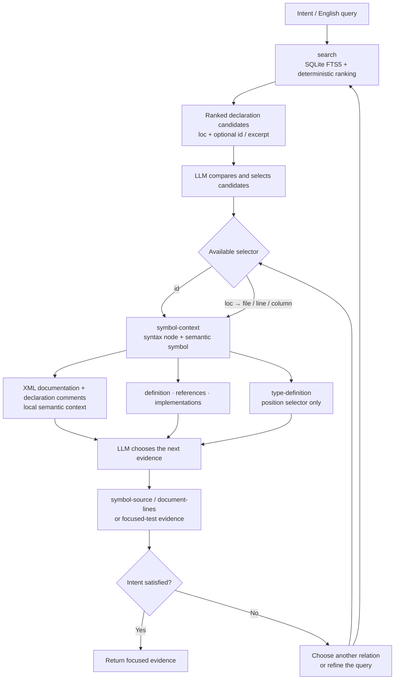

# RoslynKit

[](https://github.com/jgador/roslynkit)

RoslynKit is an independent Roslyn-powered tool for read-only C# analysis. Its Model Context Protocol (MCP) server retains loaded workspaces across requests, and its standalone command-line interface (CLI) uses the same execution engine.

The initial retained-workspace implementation is in place. [docs/architecture.md](docs/architecture.md) records the accepted design, current tradeoffs, and release acceptance criteria. Windows execution and large-repository performance validation remain pending.

Select a Git repository containing modern .NET C# projects to answer source questions such as:

- What projects and source files does this solution load?
- Where is this class or method defined?
- What references this symbol?
- What implementations exist for this interface or method?
- What type, signature, or XML documentation is available at this call site?
- What compiler diagnostics does Roslyn report for the loaded code?

RoslynKit loads .NET projects with MSBuild and asks Roslyn for source information. Roslyn is the official .NET compiler platform for C# and Visual Basic; RoslynKit currently focuses on C# inspection. Solution files are optional: repository discovery loads every tracked or unignored `.csproj`, including disconnected project components.

Results use compact, deterministic Markdown. The CLI prints that text to the terminal, and MCP returns it as tool-result text.


## Install

Install the global .NET tool from NuGet.org:

```powershell
dotnet tool install --global roslynkit
roslynkit version
```

Update an existing install:

```powershell
dotnet tool update --global roslynkit
```

Optionally scaffold the standalone CLI skill bundle from a Git repository root:

```powershell
cd ./path/to/MyApp
roslynkit init
```

`roslynkit init` scaffolds the RoslynKit skill bundle for Codex by default. Use `--agent claude`, `--agent copilot`, or `--agent all` when another supported agent should receive the same bundle. The command requires a `.git` directory in the current directory so setup happens at an ordinary Git repository root.

For local package feeds and side-by-side prerelease development installs, see [docs/dev-install.md](docs/dev-install.md). For maintainer packaging and release steps, see [docs/dotnet-tool-release.md](docs/dotnet-tool-release.md).

## MCP Quick Start

Configure an MCP client to launch this command over standard input and standard output (stdio):

```text
roslynkit serve
```

The client owns the server lifetime. The server loads scopes lazily, retains up to four by default, and stops its owned workers when the connection closes. Least-recently-used idle scopes can be evicted and reloaded; active scopes remain retained. `--max-workspaces <count>` changes the retained-scope limit; it limits scope count rather than total memory. `--no-restore` disables automatic dependency restore.

The server exposes exactly two tools:

- `help`, with optional `command`, lists operations or describes one operation.
- `query`, with required `repositoryRoot` and `args`, runs an operation in the selected repository.

For example, pass these arguments to `query`:

```json
{
  "repositoryRoot": "/absolute/path/to/MyApp",
  "args": ["symbols", "--query", "MyService", "--exact"]
}
```

Every query supplies an absolute root for an ordinary Git checkout with a `.git` directory. Paths use the server's filesystem namespace, including for Windows drive paths. Relative `--file`, `--project`, and `--target` options resolve from that root. Results identify the resolved root. An optional `--target` restricts the operation to a solution, solution filter, project, or repository directory; it does not replace `repositoryRoot`.

After an agent-initiated build attempt finishes, including a failed build, await synchronization before further analysis of that scope:

```json
{
  "repositoryRoot": "/absolute/path/to/MyApp",
  "args": ["refresh"]
}
```

Include the same `--target` when the work uses an explicit scope. `refresh` is an operation of `query`; it is not a third tool or a standalone CLI command. It checks saved inputs and waits for workspace synchronization without running a full build. A later search waits separately for its index if needed. There is no build hook.

## Workspace Lifetime and Requirements

Semantic queries use immutable Roslyn snapshots retained by server-owned workers. Saved text edits update existing C# documents; additions, deletions, renames, and changes to project membership, configuration, or references replace the loaded workspace. Existing readers can finish on their captured snapshot while new queries wait for an observed update. A failed replacement is reported to new queries until synchronization succeeds.

File watchers coalesce changes, and background reconciliation repairs missed events and watcher overflow. Detection delay is possible; ordinary queries do not rescan every input. Explicit `refresh` performs a stronger saved-input check. Semantic availability is independent of background search indexing.

Each repository uses its installed .NET Software Development Kit (SDK), selected by normal rules including `global.json`. Server-owned worker processes isolate repositories that need different SDKs. RoslynKit reports missing or unsupported SDKs and does not install them. Missing or outdated dependencies are restored when needed; an ordinary source edit does not trigger restore. Use server-wide `--no-restore` or the same option on a workspace operation to opt out. Full builds remain caller initiated.

Supported projects target a single modern .NET framework. Different projects may target different supported versions. Legacy .NET Framework, multi-targeted projects, non-Git repositories, linked worktrees, and other `.git` indirection layouts are unsupported. Platform-specific workloads require the corresponding host capabilities. Windows and Linux are validation priorities; the rewrite status above does not claim completed platform testing.

RoslynKit provides no repository trust registry or approval gate. Normal filesystem permissions apply. Read-only analysis does not sandbox MSBuild evaluation or package restore, which can execute repository build logic with the process's permissions.

## Common Tasks

| Command | Use it to |
| --- | --- |
| `serve` | Start the client-owned stdio MCP server. |
| `init` | Scaffold the RoslynKit skill bundle into a Git repository for Codex, Claude, GitHub Copilot, or all supported agents. |
| `workspace` | See which projects and documents load. |
| `diagnostics` | Check compiler diagnostics. |
| `index` | Prepare or refresh a persistent C# search index for one target. |
| `search` | Find C# declarations from an English-oriented code question. |
| `symbol-context` | Inspect a selected syntax node, resolved symbol, nearby syntax graph, and declaration metadata. |
| `symbols` | Find C# declarations by name. |
| `document-symbols` | List declarations inside one file. |
| `definition` | Jump from a symbol or cursor position to its definition. |
| `type-definition` | Jump from a cursor position to the definition of its type. |
| `references` | Find uses of a class, method, property, field, or other symbol. |
| `implementations` | Find implementations of an interface, abstract member, or overridable member. |
| `quick-info` | Show type, signature, and documentation at a cursor position. |
| `signature-help` | Show overload information for a method call. |
| `document-lines`, `document-text`, `symbol-source` | Read source from the loaded workspace. |

For exact command syntax, use `roslynkit help`, `roslynkit help <command>`, or [.agents/skills/roslynkit/references/commands.md](.agents/skills/roslynkit/references/commands.md).

## CLI Quick Start

Start with repository setup, then confirm RoslynKit can load a solution or project:

```powershell
cd ./path/to/MyApp
roslynkit init
roslynkit workspace
roslynkit diagnostics
```

Run `roslynkit init` from the repository root. The command checks the current directory for `.git` and fails from a parent folder or nested source folder that does not contain `.git`.

Find a declaration by name, then reuse the returned symbol ID for more precise navigation:

```powershell
roslynkit symbols --query MyService --exact --kind class
roslynkit definition --symbol "T:MyApp.MyService"
roslynkit references --symbol "M:MyApp.MyService.Execute(System.String)" --max-results 25
roslynkit symbol-source --symbol "M:MyApp.MyService.Execute(System.String)"
```

Read a small source window from the workspace Roslyn loaded:

```powershell
roslynkit document-lines --file ./src/MyApp/Service.cs --start-line 40 --end-line 52
```

By default, the CLI finds the nearest standard `.git/` directory and loads every tracked or unignored `.csproj` file in that repository. Use optional `--target` only to narrow a command to a `.slnx`, `.sln`, `.slnf`, `.csproj`, or repository-directory scope. Source positions are one-based, matching editor line and column numbers. Each CLI invocation owns a short-lived workspace and may incur cold startup; it does not attach to an existing MCP server. Workspace operations accept `--no-restore`.

## Search Index

Use `search` when the relevant declaration is not known by name but an English-oriented description is available. It builds on SQLite Full-Text Search 5 (FTS5), then uses Best Matching 25 (BM25) ranking internally to order C# symbols. The rank is a discovery heuristic, not a claim that the first result is the correct navigation target.

The repository and database are implicit in ordinary use:

```powershell
roslynkit index
roslynkit search --query "where is configuration validated during startup"
```

RoslynKit stores the repository search index at `.roslynkit/roslynkit.db` and creates `.roslynkit/.gitignore` for the database, its write-ahead logging (WAL) sidecars, and that generated ignore file. It never writes inside `.git/` or modifies the repository's root `.gitignore`. `--index-path` remains an advanced override and must resolve to an ignored path inside the repository.

One database belongs to one repository and stores separate partitions for repository and explicit-target scopes. It persists declaration retrieval fields, navigation identities, paths, locations, excerpts, and input metadata needed to detect outdated data. Paths remain repository-relative in SQLite and are reconstructed from the current repository root for output. Exact symbols, references, implementations, and compiler context come from live Roslyn snapshots. There is no separate persistent semantic catalog or application-level cache of completed query answers.

`search` prepares the index automatically and waits when relevant inputs are known to have changed. Retained scopes update their indexes in the background; semantic queries do not wait for indexing once workspace synchronization finishes. `index` explicitly prepares the selected partition; use `--rebuild` to recreate it. Independent local clients keep separate workspaces and coordinate publication to compatible partitions in the same database. Shared databases on network filesystems are outside the supported scope.

For a search-only workflow on a host that cannot load an MSBuild workspace, add `--text-only` to both `index` and `search`. This mode scans repository C# files into a separate in-process partition without MSBuild. Add `--compact` when a large language model (LLM) should judge ranked evidence without navigation metadata, and `--balanced` to reserve half of a bounded result set for focused tests when both production and test declarations match. `--text-only` cannot be combined with `--project`; use normal search when exact project evaluation or a follow-up `id:` is required.

```powershell
roslynkit index --text-only
roslynkit search --query "configuration validation fallback" --max-results 25 --text-only --compact --balanced
```

The search index accepts only projects with one target framework. It rejects multi-targeted projects instead of selecting a framework implicitly. Every indexed project and non-generated source document must have an existing physical path inside the target's Git worktree; missing project or non-generated source paths, external projects, and external linked non-generated source files are rejected. Generated source documents are skipped, including source-generated documents, generated paths below `bin` or `obj`, and sources with standard generated-code markers injected from extracted NuGet packages outside the worktree. By default a target search covers every project; use `--project` to narrow it, `--kind` to select symbol kinds, and `--max-results` to change the default limit of 25.

Search results are not command pipelines. They contain ranked symbols, locations, and, when available, `id:` values. An agent evaluates several results and follows a promising `id:` with `symbol-context`, `definition`, `references`, or `symbol-source`; a `loc:` value can guide a position-based command or narrow source read. RoslynKit does not accept search hits through standard input. When an `excerpt:` is present, `excerpt-source:` identifies whether its text came from documentation, an ordinary comment, a signature, or a body.

## Symbol Context

A syntax node is source structure, such as an `InvocationExpression` or `MethodDeclaration`. A symbol is the compiler-resolved identity connected to that structure, such as `M:MyApp.Validator.Validate(MyApp.Configuration)`. `symbol-context` starts from either identity or a source position and returns both views without persisting a syntax-tree node between commands.

```powershell
roslynkit search --query "where does startup validate configuration" --max-results 25
roslynkit symbol-context --symbol "M:MyApp.Validator.Validate(MyApp.Configuration)"
roslynkit symbol-context --file ./src/MyApp/Startup.cs --line 42 --column 18
roslynkit references --symbol "M:MyApp.Validator.Validate(MyApp.Configuration)" --max-results 25
```

`symbol-context` accepts exactly one selector: `--symbol <selector>`, or `--file` plus `--line` and `--column`. Position selection also supports the normal document-context options. Its output contains the selected node and resolved symbol, alternate declarations when applicable, nearest-first syntax ancestors, and bounded descendant nodes for declarations, invocations, constructions, and member references. The selected node and ancestors include source location, syntax kind, and available `name:` or `id:` values. Descendant items include source location, syntax kind, relationship, depth, and available `target-id:` values for the next semantic hop.

The command reports XML documentation separately from ordinary C# comments. Ordinary comments are structured with placement, style, location, and normalized text. `--max-results` defaults to `25` descendant items and `--max-comments` defaults to `3` comments; each bounded collection reports its count and truncation state.

The intended intent-to-evidence loop is:



This diagram describes the semantic workflow rather than the execution transport. RoslynKit provides deterministic results and stable identities. The LLM retains the intent, selects the next relationship, records visited identities or locations to avoid cycles, and stops after evidence satisfies that intent. Documentation and ordinary comments are routing hints, not proof; confirm a route with `definition`, `references`, `implementations`, `symbol-source`, or a narrow `document-lines` read.

## Standalone CLI and Skill Files

The standalone CLI remains available for terminal and script workflows through the shared execution engine. Retained workspaces belong to the MCP client session; no independently discoverable daemon or Language Server Protocol (LSP) dependency is required.

The stable CLI skill lives at [.agents/skills/roslynkit/SKILL.md](.agents/skills/roslynkit/SKILL.md), and the repo-local development skill lives at [.agents/skills/roslynkit-dev/SKILL.md](.agents/skills/roslynkit-dev/SKILL.md). These bundles provide command-routing guidance. [docs/architecture.md](docs/architecture.md) owns the retained-workspace architecture, and MCP clients discover operations through `help`.

Scaffold the stable skill bundle from the Git repository root:

```powershell
cd ./path/to/MyApp
roslynkit init
roslynkit init --agent claude
roslynkit init --agent copilot
roslynkit init --agent all
```

`roslynkit init` requires a `.git` directory in the current directory and refuses to replace changed files unless `--overwrite` is supplied. Running the command from a parent folder or nested source folder fails unless that folder is itself the Git root. Linked worktrees and other `.git` indirection files are unsupported. The selected agent controls only the outer folder:

- `codex` -> `.agents/skills/roslynkit/`
- `claude` -> `.claude/skills/roslynkit/`
- `copilot` -> `.github/skills/roslynkit/`

The bundle contents stay the same for every agent: `SKILL.md` plus the `references/` docs.

## Selecting Documents

Standalone document commands accept `--file <path>` and infer the repository from that file when `--target` is omitted. MCP queries always require `repositoryRoot`.

Relative `--file` values resolve from the CLI's current working directory or the MCP query's explicit repository root. Absolute paths are accepted.

Use `workspace` first when the same file appears in multiple project contexts or when generated, additional, or analyzer configuration documents are needed. If one path maps to multiple documents, retry with `--project <path>`, `--tfm <framework>`, or `--document-kind <source|sourceGenerated|additional|analyzerConfig>` from the usage error. The framework selector can distinguish supported project contexts; it does not enable multi-targeted projects.

Use `document-lines` for a small source range. Use `document-text` for the full resolved document, including source-generated, additional, or analyzer configuration documents.

## Selecting Symbols

`definition`, `references`, `implementations`, and `symbol-context` accept either a cursor-style selector or a symbol selector:

```powershell
roslynkit definition --file ./src/MyApp/Service.cs --line 42 --column 18
roslynkit definition --symbol "M:MyApp.MyService.Execute(System.String)"
roslynkit symbol-context --symbol "M:MyApp.MyService.Execute(System.String)"
```

The `--symbol` selector can be a Roslyn documentation-comment ID emitted as `id:` in command output, such as `T:MyApp.MyService` or `M:MyApp.MyService.Execute(System.String)`, or a qualified symbol name such as `MyApp.MyService.Execute`. Prefix meanings are defined in [.agents/skills/roslynkit/references/output.md](.agents/skills/roslynkit/references/output.md).

If a qualified name is ambiguous, RoslynKit fails with candidate documentation-comment IDs for a retry with the exact symbol. Symbol IDs are more stable than saved line and column coordinates when files are changing.

## Output

Successful CLI commands print compact markdown-flavored text:

```markdown
command: symbols
query: `MyService`
returned: 2/2
truncated: false

- kind: NamedType name: `MyApp.MyService` loc: `src/MyApp/MyService.cs:8:14-8:23` id: `T:MyApp.MyService`
  documentation: Runs application work for the current request.
```

CLI failures print a short error block and exit non-zero:

```text
error: usage
message: Missing required option '--query'.
```

CLI exit codes are `0` for success, `2` for usage errors, `130` for cancellation, and `1` for other failures. MCP returns the same Markdown in text content, identifies the resolved repository root, and marks failed tool results with `isError: true`. During `serve`, stdout carries only protocol messages and stderr carries diagnostics. See [.agents/skills/roslynkit/references/output.md](.agents/skills/roslynkit/references/output.md) for the complete output contract.

## Documentation

- [docs/architecture.md](docs/architecture.md): accepted retained-workspace architecture and rewrite acceptance criteria.
- [.agents/skills/roslynkit/references/commands.md](.agents/skills/roslynkit/references/commands.md): generated command names, usage strings, and options.
- [.agents/skills/roslynkit/references/output.md](.agents/skills/roslynkit/references/output.md): command output contract.
- [docs/dev-install.md](docs/dev-install.md): side-by-side prerelease development install.
- [docs/dotnet-tool-release.md](docs/dotnet-tool-release.md): maintainer packaging and release workflow.
- [docs/roslyn-lsp-commands.md](docs/roslyn-lsp-commands.md): Roslyn language-server inventory and RoslynKit planning coverage.
- [docs/benchmark.md](docs/benchmark.md): opt-in Bash-controlled raw-text versus RoslynKit text-only token benchmark.
- [docs/agents/README.md](docs/agents/README.md): operational docs for people maintaining RoslynKit skill files and AI-tool guidance.

## Non-Goals

- No independent daemon or public worker endpoint.
- No separate semantic catalog or completed-query answer cache.
- No LSP dependency.
- No editor-specific protocol coupling.
- No source mutation by default. If edit-producing features are added later, they should return deterministic proposed edits before any apply mode exists.
