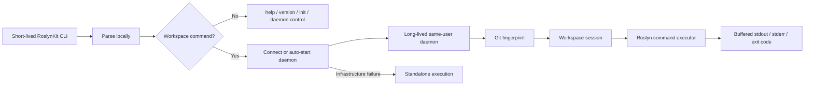

# Workspace Daemon

This document is the canonical design contract for RoslynKit's optional workspace daemon. The daemon is an approved architecture that is being implemented incrementally; until its routing and lifecycle are complete, workspace commands continue to execute standalone.

## Purpose

Loading an `MSBuildWorkspace` reevaluates the target solution or project. Repeating that work in every short-lived CLI process dominates many read-only searches. The daemon keeps one loaded workspace and its current immutable `Solution` snapshot alive across compatible CLI invocations.

The daemon is a transparent performance optimization, not a correctness authority or a new user-facing server product. If daemon infrastructure is unavailable, an eligible read-only command executes through the existing standalone path.



## Lifecycle and identity

- The first workspace-backed command connects to a compatible daemon or starts the same RoslynKit executable in a hidden internal server mode. There is no public `daemon start` command.
- `help`, `version`, `init`, `daemon status`, and `daemon stop` execute locally. Status and stop never start a daemon.
- A compatibility identity includes the current user, canonical Git worktree and target, exact protocol and RoslynKit code/build identity, process architecture, resolved .NET SDK and MSBuild identity, applicable `global.json`, agreed build environment values, and the runtime directory used by local IPC.
- The endpoint is a fixed-length opaque hash of the canonical identity. Repository paths never appear in endpoint names.
- A short-lived bootstrap lock prevents concurrent clients from racing to start a server. A separate daemon-lifetime lease enforces one live server for the identity. After acquiring the bootstrap lock, a client rechecks connectivity before spawning.
- Readiness requires a versioned protocol handshake. The existence of a pipe or socket is not sufficient.
- The daemon exits after five minutes with no active or queued requests. Status requests do not reset this timer.
- Stop rejects new work, drains active requests, and cancels remaining work after 30 seconds.
- Toolchain or identity changes select another daemon. An obsolete daemon exits through its normal idle lifecycle.
- The daemon writes no persistent log. Status may expose a bounded in-memory diagnostic summary.

### Workspace identity resolution

`GitWorkspaceIdentityResolver` implements the workspace and toolchain portion of the compatibility identity without loading an `MSBuildWorkspace`. Daemon routing does not consume it yet. Resolution currently:

1. Converts an existing `.sln`, `.slnx`, or `.csproj` target to an absolute path and resolves existing symbolic-link or reparse-point components.
2. Resolves the worktree with `git rev-parse --path-format=absolute --show-toplevel` and requires `git rev-parse --verify HEAD^{commit}` to succeed.
3. Rejects a target worktree that is a submodule, a repository nested under another worktree, or a repository containing configured submodules.
4. Requires the resolved root to occur exactly once in `git worktree list --porcelain -z`. Other linked worktrees for the same repository remain compatible because each target still belongs to exactly one worktree.
5. Captures the nearest `global.json` found by walking from the target directory to the filesystem root as its canonical path plus a SHA-256 content digest.
6. Captures `dotnet --version` from the target directory and queries `MSBuildLocator` with that directory to record the selected instance, discovery type, instance version, MSBuild path, and `MSBuild.dll` product version.
7. Captures the RoslynKit informational version, module version ID, daemon protocol version, and process architecture.

The explicit build-environment allowlist is `Configuration`, `Platform`, `DOTNET_CLI_HOME`, `DOTNET_HOST_PATH`, `DOTNET_MSBUILD_SDK_RESOLVER_CLI_DIR`, `DOTNET_ROLL_FORWARD`, `DOTNET_ROLL_FORWARD_TO_PRERELEASE`, `DOTNET_ROOT`, `DOTNET_ROOT_X64`, `DOTNET_ROOT_X86`, `MSBUILD_EXE_PATH`, `MSBuildExtensionsPath`, `MSBuildExtensionsPath32`, `MSBuildExtensionsPath64`, `MSBuildSDKsPath`, `NUGET_FALLBACK_PACKAGES`, `NUGET_HTTP_CACHE_PATH`, `NUGET_PACKAGES`, `NUGET_PLUGINS_CACHE_PATH`, and `NUGET_PLUGIN_PATHS`. Unset values are retained as explicit null entries so set and unset environments cannot compare as the same identity accidentally. Other environment-dependent evaluation remains outside the supported boundary.

The committed `HEAD` is validated here but is not part of daemon compatibility identity. `HEAD` is mutable worktree state and belongs to the per-request Git fingerprint, allowing a commit to reload the existing daemon rather than selecting a different endpoint.

### Endpoint identity and naming

`DaemonIdentityResolver` adds the current operating-system user and local IPC runtime directory to a resolved `GitWorkspaceIdentity`. Windows users are identified by SID, Unix users by effective numeric UID, and the runtime directory is the canonical form of the process runtime directory returned by `Path.GetTempPath()`. The resolver snapshots the build-environment mapping so later mutation cannot change an already-created identity.

`DaemonEndpointName` serializes every compatibility field in a fixed JSON property order, sorts build-environment entries ordinally, preserves null values, and hashes the UTF-8 bytes with SHA-256. The resulting endpoint name has the fixed format `roslynkit-v1-<64 lowercase hexadecimal characters>`. It contains no repository path, target path, environment value, or user identifier. The endpoint can now be passed to the named-pipe factory, but CLI routing, bootstrap locking, and daemon hosting do not consume it yet.

## Supported workspace boundary

Daemon acceleration initially supports one Git worktree with a committed `HEAD` and one solution or project target inside that worktree.

The following cases execute standalone or remain unsupported for daemon acceleration:

- unborn repositories or targets outside a Git worktree;
- submodules, nested repositories, or workspaces spanning multiple repositories;
- linked or imported build inputs outside the worktree;
- arbitrary environment-dependent MSBuild evaluation not represented in the compatibility identity;
- Git-ignored files used as active build inputs;
- tracked files hidden from status by `assume-unchanged` or `skip-worktree`;
- raw worktree-byte changes that Git clean filters, line-ending normalization, LFS, `ident`, or custom filters report as clean.

These limitations mean the performance-only correctness claim applies inside this supported boundary. A filesystem watcher and incremental `Solution.WithDocumentText` updates are explicitly out of scope. Any detected fingerprint change causes a full MSBuild workspace reload.

## Git fingerprint

Each workspace request reconciles Git state before leasing a snapshot. Concurrent requests share one in-progress fingerprint calculation. The complete operation has a five-second deadline.

`GitWorktreeFingerprintService` accepts the canonical worktree root from workspace identity resolution, coalesces only concurrent captures, and returns either a structural `GitWorktreeFingerprint` or a typed failure that forbids cache reuse. `WorkspaceDaemonSession` consumes this service before leasing or replacing a workspace generation. Daemon host routing does not consume the session yet.

The capture uses `ProcessStartInfo.ArgumentList` and Git-native object hashing:

```text
git -C <root> rev-parse --verify HEAD^{commit}
git -C <root> --no-optional-locks status --porcelain=v1 -z --untracked-files=all --no-renames --ignore-submodules=none
git -C <root> hash-object --no-filters -- <changed-or-untracked-paths>
```

`hash-object` is never invoked with `-w`. Paths are passed in bounded argument batches, not through a shell or newline-delimited `--stdin-paths`. Missing paths receive an explicit marker. Records and per-file blob IDs are sorted deterministically.

A stable capture is:

1. Read `HEAD` as `HEAD0`.
2. Capture porcelain bytes as `status0`.
3. Hash every changed or untracked existing path.
4. Capture porcelain bytes again as `status1`.
5. Read `HEAD` as `HEAD1`.
6. Accept only when both HEAD values and both status captures match and every expected hash result is present.

The stable capture reduces races but is not an atomic filesystem snapshot. A Git failure, timeout, malformed record, path race, or incomplete hash result is an infrastructure failure and does not authorize reuse of the cached workspace.

## Immutable snapshots and reloads

Each command leases one captured immutable Roslyn `Solution`. A reload creates a new `MSBuildWorkspace` and `Solution`; it does not mutate the snapshot held by an active command. Historical generations are released after their active leases finish.

At most three clean-snapshot searches run concurrently. Asynchronous writer-priority coordination prevents a pending reload from admitting new searches against the old generation.

`WorkspaceDaemonSession` now implements this pre-host ownership boundary. It owns the current `RoslynWorkspaceLoader`, successful fingerprint baseline, monotonically increasing generation number, active and queued request counts, workspace state, and latest Git infrastructure diagnostic. A generation dispatches through the caller-owned `RoslynCommandExecutor` overload, so command execution never reloads or disposes the leased workspace.

Reload behavior is:

1. Compute a stable pre-load fingerprint.
2. Block new searches and wait for active searches to finish.
3. Dispose the old workspace and load a fresh workspace.
4. Compute a stable post-load fingerprint.
5. Accept the new generation when the fingerprints match.
6. Otherwise require 250 milliseconds of quiet, represented by two equal stable captures; restart the quiet interval while the fingerprint continues changing, then reload once more.
7. If the retry is also unstable, keep the latest completed snapshot usable for the current request and force the next request to reconcile and reload again.

Only a usable stable load updates the successful fingerprint baseline. The second completed snapshot may serve its initiating request after a second pre/post mismatch, but its baseline remains unset and no later request can reuse it. A Git failure returns a typed infrastructure result for future standalone fallback. A normal workspace-load or semantic command exception propagates unchanged and is not converted into daemon fallback. Session disposal waits for active leases and prevents a generation that finishes loading after disposal begins from being published.

## Local protocol and security

- `DaemonNamedPipe` creates only local asynchronous duplex streams. Server streams use byte transmission mode and `PipeOptions.CurrentUserOnly`; client streams address the local machine and also request current-user-only access. On Unix, the .NET named-pipe implementation may use a Unix-domain socket in the selected runtime directory.
- `DaemonProtocol` frames each message as a four-byte little-endian signed length followed by strict UTF-8 JSON. Request frames are limited to 1 MiB and response frames to 64 MiB. Zero, negative, and over-limit lengths are rejected before renting payload memory, and partial headers or payloads are rejected by exact-read loops.
- The JSON schema is case-sensitive and uses strict numeric tokens. It rejects comments, trailing commas, quoted numbers, unknown properties, unknown message discriminators, empty request IDs, invalid UTF-8, and malformed JSON. The closed message set covers handshake, command, status, and stop requests and responses. Every message carries the exact protocol version and request ID; the handshake layer calls `DaemonProtocol.EnsureCompatible` before dispatch.
- Command requests carry an absolute UTC deadline. `DaemonCommandRequest.Create` canonicalizes `target`, `project`, and `file` paths through the same reparse-point-aware path boundary used by workspace identity before serialization, while `ToParsedCommand` rebinds the wire options through `CliParser` before server execution. Both boundaries enforce an explicit allowlist of the current read-only workspace commands; local lifecycle commands cannot be encoded as command requests.
- Command responses carry one complete buffered `CliProcessResult`, so no process output needs to be published from a partial frame. A later aggregation layer may use bounded start/chunk/end frames if logical output must exceed the response-frame limit.
- Framing cancellation propagates through asynchronous stream operations. A peer closing between frames is distinguished from a truncated header or payload so the future host can treat an idle disconnect normally. Client disconnect cancellation and workspace-lease unwind remain daemon-host responsibilities.
- The future daemon host never changes global current directory per request and rejects a target that does not match its identity.
- Client cancellation or disconnect will cancel queued or running work and flow through Roslyn operations. The daemon host will wait for cancellation unwind before releasing a workspace lease.

The framed message codec and named-pipe stream factory are implemented as reusable pre-host seams. No daemon process accepts connections yet, and workspace commands, status, and stop are not routed through the transport in this phase.

Daemon-eligible commands are read-only. If mutating commands are introduced, request deduplication or a stricter pre-dispatch-only fallback rule is required before those commands may use the daemon.

## Fallback

Fallback is limited to daemon infrastructure failures:

- unsupported daemon workspace identity;
- Git fingerprint failure or timeout;
- daemon startup, handshake, transport, or protocol failure;
- daemon crash or connection loss.

Fallback does not apply to usage errors, ordinary workspace-load errors, semantic command errors, or explicit cancellation.

For a daemon-eligible read-only command, the client writes exactly one line to stderr before standalone execution:

```text
warning: daemon unavailable; executing standalone
```

Normal command stdout remains unchanged. Because the client exposes only complete daemon responses, a failed transport cannot mix partial daemon stdout with standalone output. Read-only execution makes a retry after an ambiguous disconnect logically safe; mutating commands require stronger at-most-once handling.

## Public lifecycle commands

The public control surface is:

```text
roslynkit daemon status --target <target>
roslynkit daemon stop --target <target>
```

Both commands are idempotent and exit successfully when no compatible daemon is running. They execute locally and never load a workspace or start a daemon. Until daemon host and control routing are implemented, both commands report `state: not-running`. Once that routing is available, status reports running state, target, process ID, workspace readiness, generation, active and queued request counts, and the latest bounded infrastructure diagnostic when available.
